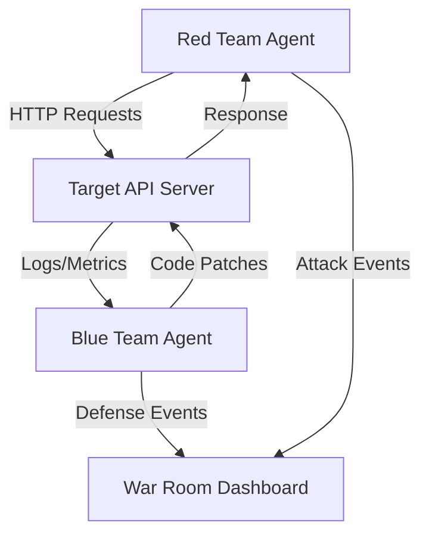

# Product Requirements Document: Holonet Cyber War Room

| Metadata | Details |
| :--- | :--- |
| **Project** | Holonet Cyber War Room (Security Simulation) |
| **Status** | Draft / Proposal |
| **Owner** | Product Engineering (Holonet Core) |
| **Last Updated** | 2026-02-27 |
| **Version** | 1.0.0 |

---

## 1. Executive Summary

**"The best way to secure a system is to break it yourself."**

The **Holonet Cyber War Room** is an autonomous, adversarial security simulation engine integrated directly into the Holonet dashboard. It gamifies and automates the eternal conflict between attackers (Red Team) and defenders (Blue Team) to harden connected API services.

Instead of static vulnerability scans, we propose a **live combat loop**:
1. A **Red Team Agent** actively attempts to exploit vulnerabilities (Fuzzing, DoS, Injection).
2. A **Blue Team Agent** monitors, analyzes, and *automatically patches* the target code in real-time.
3. A **War Room UI** visualizes this cyber-warfare, providing users with a "God Mode" view of the battle, logs, and remediation strategies.

This feature transforms Holonet from a passive management tool into an active security proving ground.

---

## 2. Strategic Value & User Goals

### 2.1 Why this?
- **Active Defense:** Moves beyond static analysis to dynamic, runtime resilience testing.
- **Self-Healing Infrastructure:** Demonstrates the power of AI not just to detect, but to *fix* code vulnerabilities on the fly.
- **Education & Visibility:** visualizes abstract security concepts (rate limiting, SQLi) into tangible, observable events.

### 2.2 User Personas
- **The Security Engineer:** Wants to stress-test their API endpoints against common attack vectors without setting up complex external pentesting tools.
- **The Backend Developer:** Wants to see how their code handles edge cases and receive instant, code-level suggestions (patches) for security flaws.
- **The Demo Viewer:** Wants a visceral, visual demonstration of AI agents interacting in a complex environment.

---

## 3. Core Components

### 3.1 Red Team Agent (The Attacker)
*Persona: Aggressive, chaotic, thorough.*

**Capabilities:**
*   **Fuzzing:** Sending malformed JSON, massive payloads, and boundary-testing integers to endpoints.
*   **DoS Simulation:** High-concurrency request flooding to test stability and resource exhaustion.
*   **Injection Probing:** Attempting common SQLi (`' OR 1=1 --`), XSS, and command injection patterns on input fields.
*   **Reconnaissance:** Endpoint discovery and method enumeration (GET, POST, DELETE).

**Success Metrics:**
*   Causing a 500 Internal Server Error.
*   Successfully bypassing authentication.
*   Extracting data that should be protected.
*   Crashing the target service.

### 3.2 Blue Team Agent (The Defender)
*Persona: Vigilant, analytical, protective.*

**Capabilities:**
*   **Log Sentinel:** Real-time tailing of access and error logs from the `Holonet-Target` server.
*   **Traffic Analysis:** Detecting anomalies in request volume (spikes) or payload patterns (SQL syntax in query params).
*   **Auto-Patching (The "Kill Switch"):**
    *   **Hot-Fix Generation:** Dynamically writing middleware or modifying route handlers.
    *   *Example:* If DoS is detected, inject a `RateLimiter` middleware.
    *   *Example:* If SQLi is detected, wrap raw queries in parameterized statements (or suggest the diff).
*   **Alerting:** Broadcasting defense actions to the War Room UI.

### 3.3 The War Room (UI/UX)
*Concept: "NORAD for your API"*

**Visual Elements:**
*   **Split View Console:**
    *   **Left (Red):** Attack log stream (e.g., "Injecting payload...", "Flooding /login...").
    *   **Right (Blue):** Defense log stream (e.g., "Pattern detected", "Applying RateLimit patch...", "Threat blocked").
*   **Live Metrics HUD:**
    *   System Health (CPU/Memory of target).
    *   Requests Per Second (RPS).
    *   "Defcon Level" (Threat severity).
*   **The Battlefield:** A central visualization (graph or map) showing request packets traveling from Attacker to Target, changing color based on status (Red=Attack, Green=Handled, Yellow=Blocked).

---

## 4. User Flow

1.  **Setup:** User navigates to the "War Room" tab in Holonet.
2.  **Configuration:**
    *   Select Target: `Holonet-Target` (localhost:3000).
    *   Select Profile: "SQL Injection Drill" or "Load Test".
3.  **Engagement:**
    *   User clicks **"INITIATE WAR GAMES"**.
    *   Red Team starts scanning and attacking.
    *   UI updates with live attack vectors.
4.  **Reaction:**
    *   Target server throws errors or slows down.
    *   Blue Team detects the pattern.
    *   Blue Team proposes/applies a patch (e.g., adds input validation).
5.  **Resolution:**
    *   Red Team retries the attack.
    *   Attack fails (403 Forbidden or 429 Too Many Requests).
    *   Simulation ends with a "Post-Mortem Report".

---

## 5. Technical Specifications

### 5.1 Architecture Diagram

### 5.2 Tech Stack
*   **Orchestration:** Node.js (Holonet Core).
*   **Agents:**
    *   LLM-driven decision making (OpenAI/Anthropic via standard Holonet provider).
    *   Stateless execution loops for speed.
*   **Target Communication:**
    *   HTTP Client (Axios/Fetch) for attacks.
    *   File System (fs) for Blue Team patching (Hot-reloading required on Target).
    *   WebSocket / SSE for real-time UI streaming.

### 5.3 Safety Rails
*   **Sandbox Only:** The Red Team must *only* target the whitelisted `Holonet-Target` URL/port.
*   **Rollback:** Blue Team must create a backup of any file before patching. "Reset Target" button required.
*   **Resource Limits:** Attacks must have a hard cap on RPS to prevent crashing the host machine (not just the target server).

---

## 6. Phased Roadmap

### Phase 1: The Skirmish (MVP)
*   **Objective:** Basic connection and simple interaction.
*   **Features:**
    *   Manual Red Team trigger (one attack type: "Flood").
    *   Passive Blue Team (Log viewer only, no patching).
    *   Basic Split-view UI.
    *   Target: `Holonet-Target` simple Express server.

### Phase 2: The Defender Rises
*   **Objective:** Automated defense mechanisms.
*   **Features:**
    *   Blue Team analyzes logs and suggests text-based fixes.
    *   Red Team adds "SQL Injection" probing.
    *   UI visualizes "Health" vs "Threat".

### Phase 3: Total War (Auto-Patching)
*   **Objective:** Full loop autonomy.
*   **Features:**
    *   Blue Team can write files to `Holonet-Target` to apply middleware.
    *   Red Team uses LLM to generate novel payloads.
    *   Post-game report generation.

---

## 7. Open Questions / Risks
*   **Risk:** Can the Blue Team's hot-patching break the server syntax, causing a crash that Red Team didn't cause?
    *   *Mitigation:* Syntax check step before saving file.
*   **Risk:** LLM Latency. Real-time war might be slow if waiting for tokens.
    *   *Mitigation:* Use smaller, faster models for the loop, or pre-canned attack strategies mixed with AI planning.
